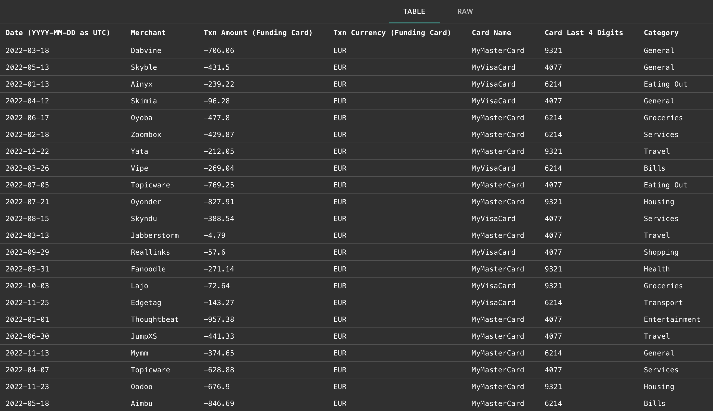
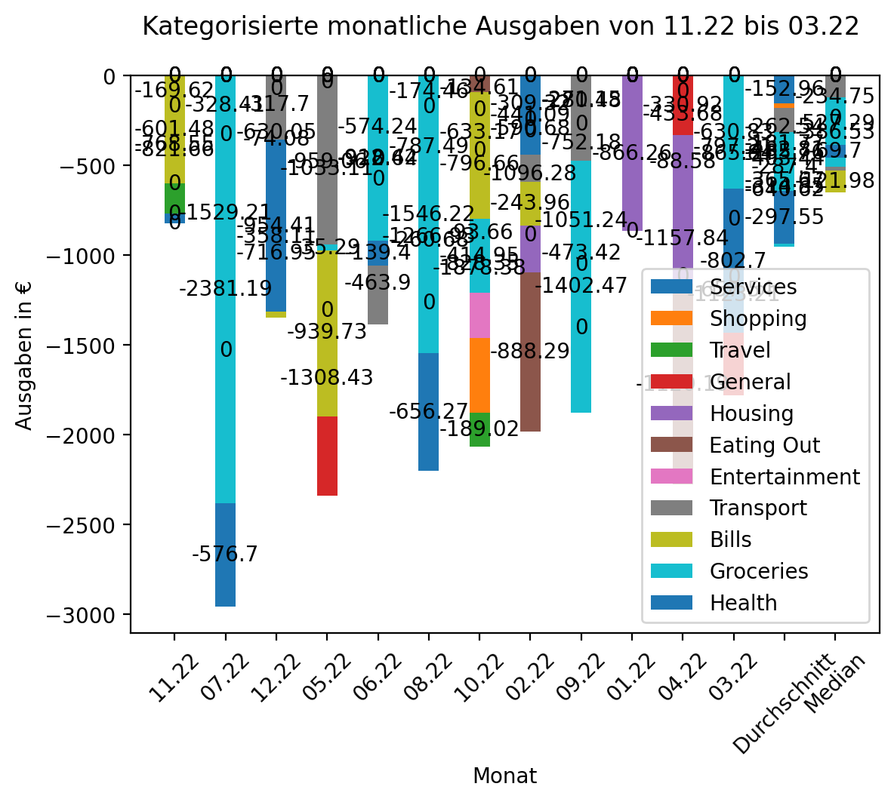

# Expense-visualization
This repository takes a csv file of the following schema:


and creates a visualization of the expenses using [pythons](https://python.org) libraries [matplotlib](https://matplotlib.org/) and [pandas](https:pandas.pydata.org). 

The result looks similiar to this:


## Usage

### Prerequisites

- [python](https://python.org)
- [matplotlib](https://matplotlib.org/)
- [pandas](https://pandas.pydata.org/)

### Installation

```bash
git clone https://github.com/FabianFelixKraus/expense-visualization.git
```

### Run


```bash
python main.py
```

## Support

If you like to improve this repository, feel free to create a pull request.
